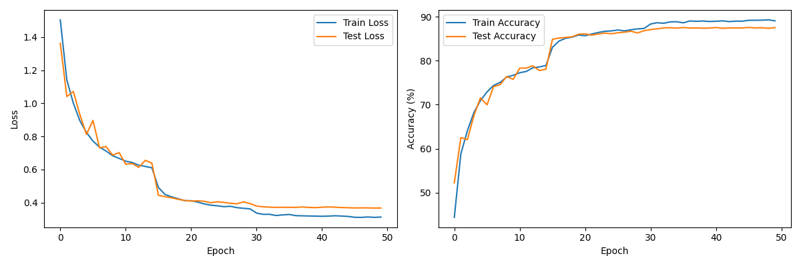

<h3><b> Session 8 </h3>

<h3><i><b>Advanced Neural Network Architectures</b></i></h2>

---

**Target:**
1. Write a new network that works on CIFAR10 Dataset.
2. has the architecture to C1C2C3C40 (No MaxPooling, but convolutions, where the last one has a stride of 2 instead) (NO restriction on using 1x1) (If you can figure out how to use Dilated kernels here instead of MP or strided convolution, then 200pts extra!)
3. total RF must be more than 44
4. one of the layers must use Depthwise Separable Convolution
5. one of the layers must use Dilated Convolution
6. use GAP (compulsory):- add FC after GAP to target #of classes (optional)
7. use albumentation library and apply:
    - horizontal flip
    - shiftScaleRotate
    - coarseDropout (max_holes = 1, max_height=16px, max_width=16, min_holes = 1, min_height=16px, min_width=16px, fill_value=(mean of your dataset), mask_fill_value = None)
8. achieve 85% accuracy, as many epochs as you want. Total Params to be less than 200k.
9. make sure you're following code-modularity (else 0 for full assignment) 

**Model details**
1. Model params - 179,904
2. Optimizer - SGD
3. Variable LR - StepLR
4. Epochs - 20
5. Batch Size - 128
6. Use of Depth-wise separable convolution (groups followed by 1x1 conv)
7. Use of dilated kernel (dilation=2)
8. Use of GAP
9. Use of FC layer.

**Results**
1. 85% accuracy with <200K parameters  
    - Train Accuracy - 85.41%
    - Test Accuracy - 85.48%
    - Accuracy/Loss plot - 

---
